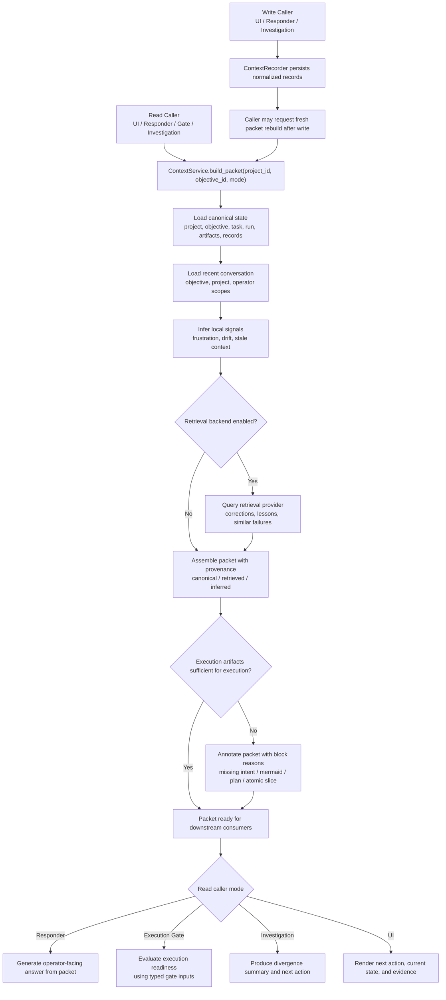

# Context Management Service

## Goal

Centralize context management into one harness-owned service instead of letting
UI code, responder code, execution code, and retrieval code each assemble their
own partial view of context.

The service should be the single place that:

- builds the current context packet for an objective
- decides what is canonical vs retrieved vs inferred
- exposes a stable contract to the UI, responder, investigation, and execution
  gates

This keeps context management mandatory while avoiding a second control plane.

## Problem

The current design has the right ingredients but not a single authority:

- the harness store contains canonical records
- `ui_responder` wants a typed packet
- Open Brain or another retrieval layer may augment memory
- execution gates depend on intent and Mermaid state
- frustration, divergence, and operator corrections must be durable

Without a dedicated service, each caller will rebuild context differently and
drift in subtle ways.

## Proposed Service

Introduce one `ContextService` under harness control.

Responsibilities:

- load canonical objective context from the harness store
- assemble a typed `ObjectiveContextPacket`
- query an optional retrieval backend for relevant prior memory
- merge canonical, retrieved, and inferred signals without blurring them
- compute reusable drift, frustration, and stale-context signals
- expose reusable helpers for execution gating and investigation

Non-responsibilities:

- not the source of truth for tasks, runs, objectives, or artifacts
- not a replacement for the store
- not an autonomous planner
- not a second chat transcript system
- not the owner of all context-related writes

## Service Boundary

Inputs:

- `project_id`
- `objective_id`
- optional current operator message
- optional recent conversation turns
- optional caller mode such as `ui`, `responder`, `execution_gate`,
  `investigation`

Outputs:

- `ObjectiveContextPacket`
- context-derived gate signals
- optional retrieval metadata

## Canonical Packet Shape

The service should produce one typed packet with these sections:

### Identity

- `project`
- `objective`
- `current_task`
- `current_run`
- `operator_scope`

### Control Artifacts

- `intent_model`
- `mermaid_artifact`
- `plan_summary`
- `atomic_slice_summary`
- `execution_gate`

### Conversation

- `recent_operator_turns`
- `recent_harness_turns`
- `current_message`

### Derived Signals

- `frustration_signal`
- `intent_drift_signal`
- `process_drift_signal`
- `stale_context_signal`
- `recommended_next_action`

### Retrieved Memory

- `prior_operator_corrections`
- `prior_frustration_patterns`
- `relevant_lessons`
- `similar_failures`
- `prior_investigations`
- `project_level_context`

### Provenance

- `canonical_refs`
- `retrieval_refs`
- `inference_refs`
- `packet_built_at`

The key rule is that the packet must preserve provenance. Retrieved memory must
never look canonical, and inferred signals must never look operator-approved.

## Companion Write Boundary

Centralized context management still needs normalized writes, but packet
assembly and reasoning should remain distinct from persistence.

Use a companion boundary such as `ContextRecorder` or
`ContextMutationService` for:

- `record_operator_comment`
- `record_operator_frustration`
- `record_intent_model`
- `record_mermaid_snapshot`
- `record_investigation`
- `record_lesson`
- `record_context_correction`
- `record_packet_receipt`

Rules:

- writes must still be normalized in one place
- `ContextService.build_packet()` should remain read-only
- callers may compose `ContextRecorder` + `ContextService` in one flow
- derived packet reasoning may inform writes, but writes must not be hidden
  inside packet assembly

## Drift Rules

The service should compute drift explicitly instead of leaving it implicit in UI
or worker behavior.

Primary drift checks:

- `intent_vs_mermaid`
- `mermaid_vs_plan`
- `plan_vs_tasks`
- `tasks_vs_runs`
- `runtime_vs_operator_feedback`
- `current_message_vs_last_confirmed_intent`

Each drift signal should carry:

- `kind`
- `severity`
- `summary`
- `evidence_refs`
- `suggested_action`

## Retrieval Boundary

Retrieval is optional and additive.

Rules:

- the harness store remains canonical
- retrieval can add relevant memory but cannot override current state
- retrieval results must be attached as separate packet sections
- if retrieval is unavailable, packet construction still succeeds

## Execution Gate Integration

Execution gating should read from `ContextService`, not independently from the
store and not directly from UI state.

That means:

1. caller asks `ContextService` for the current packet
2. service computes gate inputs from the packet
3. execution gate uses those typed inputs
4. any missing or stale control artifact becomes an explicit block reason

This avoids duplicate logic around intent existence, Mermaid completion,
staleness, and drift.

Important rule:

- `ContextService` always builds the best available packet first
- execution gating is a consumer of the packet, not a prerequisite for packet
  assembly

That means the UI and responder still get a useful packet when control
artifacts are missing. Missing artifacts become explicit fields and block
reasons, not an excuse to skip context assembly.

## Central Flow Mermaid

## Execution Contract

This Mermaid should be implemented with these exact invariants:

1. `ContextService.build_packet(...)` is always read-only.
2. Packet assembly always runs before any execution-sufficiency evaluation.
3. Missing execution artifacts can block execution, but they do not block packet construction.
4. UI, responder, and investigation flows may consume partial packets with explicit block reasons.
5. `ContextRecorder` is the normalized write boundary and is not a caller mode of `ContextService`.
6. Retrieval is additive only and cannot override canonical harness state.
7. After a normalized write, the caller may request a fresh packet rebuild, but rebuild is an explicit next step.

## Missing Gaps Filled

The current repo-level design had these missing pieces, which this service
should close:

1. One packet authority
   The packet is built in one place instead of ad hoc in responder or UI code.

2. Provenance separation
   Canonical state, retrieval output, and inferred signals stay visibly
   separate.

3. Shared drift computation
   Drift becomes a reusable service concern instead of scattered heuristics.

4. Clean read/write separation
   Packet assembly stays pure while normalized writes still go through one
   companion boundary.

5. Gate consistency
   Execution gates consume the same packet the responder and UI consume.

6. Retrieval isolation
   Retrieval is optional and cannot quietly mutate workflow truth.

7. Operator correction durability
   Corrections become first-class context records that future packets can reuse.

8. Cross-scope context
   Objective, project, and operator-level context can all participate without
   pretending everything is only objective-local.

## Suggested Implementation Slice

Initial bounded implementation:

- add `src/accruvia_harness/services/context_service.py`
- define `ObjectiveContextPacket` and supporting signal dataclasses
- move packet assembly logic out of responder/UI-specific code into the service
- add `src/accruvia_harness/services/context_recorder.py` or equivalent
  companion write boundary
- wire `context_control.objective_execution_gate` to consume service output
- keep retrieval behind an interface with a local no-op default

## Acceptance Criteria

- one service builds the context packet for all major callers
- packet fields are typed and provenance-aware
- packet assembly remains useful even when required control artifacts are
  missing
- writes are normalized centrally but not hidden inside packet construction
- execution gates use service-derived context instead of bespoke lookups
- retrieval remains optional and non-authoritative
- frustration and correction records persist through the same service boundary
- Mermaid, intent, and drift status are explicit in the returned packet
